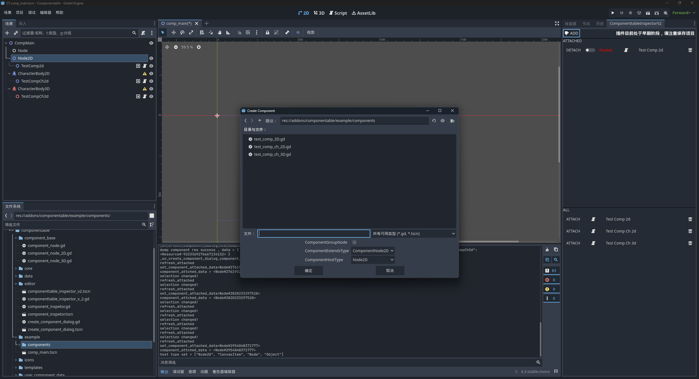
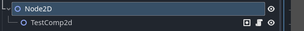
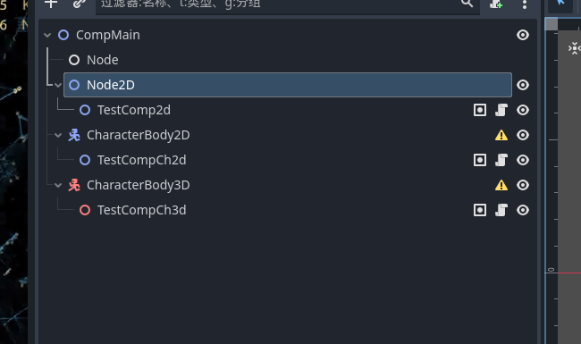
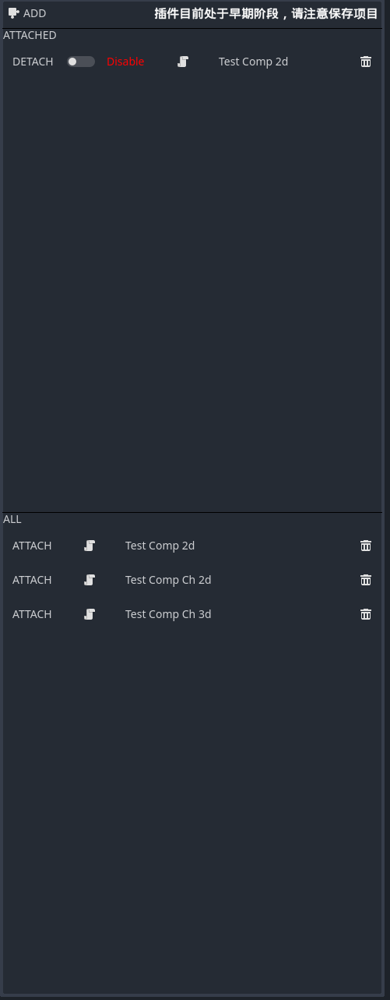

<p align="center">
  
</p>

# EasyComponent
面向组件编程在Godot中时一个比较好的编程模型，此插件帮助开发者在Godot中创建组件，简化重复行为。

> 项目处于早期阶段！请注意保护项目数据，推荐使用git。

> 此插件在 4.3 版本开发。

> 此插件受到 https://github.com/GumpDev/componentable 启发，感谢你的贡献！

## 为什么要制作这个插件

### 我发现有很多ECS 插件，这与他们有何不同？
本插件的主要目的是组件复用，它的功能非常轻量化，如果你需要管理动辄上千个节点的数据，请使用ECS插件。

### 我可以使用componentable而不是EasyComponent
这取决于你的逻辑复用的粒度，如果你仅仅想要复用代码逻辑，我更推荐你使用componentable

### EasyComponent 提供了什么？


commponentable 生成的组件基类继承了 Node，这意味着组件本身只能承载逻辑，而不能作为一个真正的实体。

这对于简单的逻辑复用非常友好，但是对于更粗粒度的功能复用就有些力不从心。
EasyComponent 目前提供了3个可用的基类
- ComponentNode
- ComponentNode2D
- ComponentNode3D

创建插件时，宿主类型可选当前宿主的自定义类型，其父类以及任意级别的间接父类。

创建时，需要指定一个脚本文件，插件会为你自动生成内容，以下是一个生成示例：
```php
extends ComponentNode2D
class_name TestComp2d 
@export @onready var host:Node2D = get_host()

const kComponentExtendTypeName = "ComponentNode2D"
const kComponentClassName = "TestComp2d"
const kComponentHostTypeName = "Node2D"
```

host 被指定为Node2D，创建时你可以选择Node2D和Node，使用Node意味着你的插件适用范围更广，使用Node2D意味着你的组件更加精细。这取决于你的需求。

创建完成后，系统将自动挂载此组件到宿主节点上。




## 安装
下载本仓库，复制 EasyComponent 文件夹到你的 Godot addons 目录下。

在编辑器中启用此插件

## 使用
首先，点击一个节点，使其处于选中状态。

点击插件中的 ADD 按钮，选择一个路径，填写组件名称和后缀名（计划支持gd和tscn， 目前仅完成gd），选择组件继承的类型（系统自动计算，一般不需要手动选择），选择宿主类型。

点击确定组件创建完毕。宿主自动挂载该组件，同时记录到组件数据库。

以下是一个创建过多个组件的场景树和插件界面：



- Attached 显示当前点击的节点挂载的组件，您可以点击Detach按钮，从节点中分离组件。
- All 显示组件数据库中保存的组件列表，您可以点击Attach按钮，将组件挂载到当前点击的节点上。
- 垃圾桶按钮表示从组件数据库中删除此组件，请注意，用户要首先删除挂载的组件，插件无法保证数据一致性。但是这不会导致编辑器崩溃。

点击开关按钮，可以激活或者关闭组件，这会影响组件中的enable变量的值，需要用户自己处理对应逻辑。

## 计划
1. 支持tscn插件，对比单一的脚本，tscn拥有更强的组织能力。（优先）
2. 支持UI基类
3. 支持viewport基类
4. 国际化
5. 替换logo


## 贡献
欢迎提交PR 
